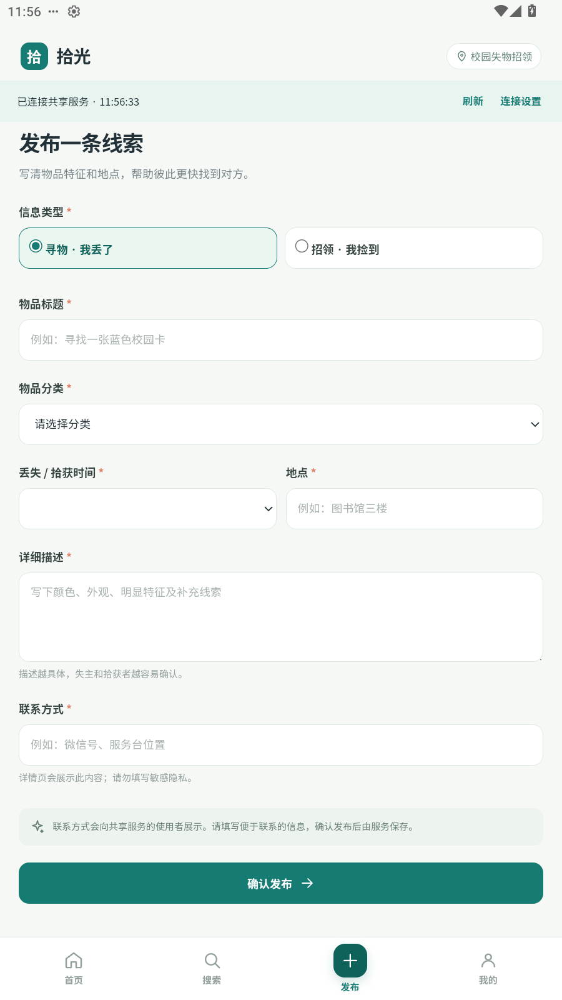
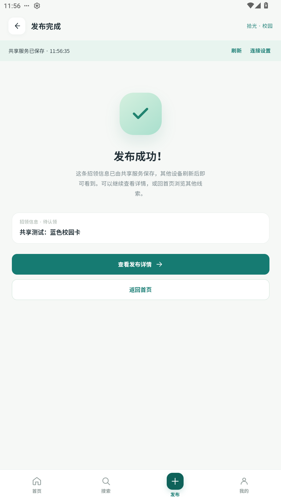
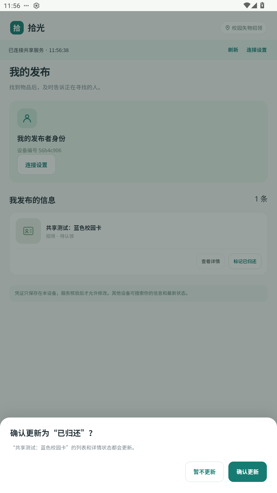
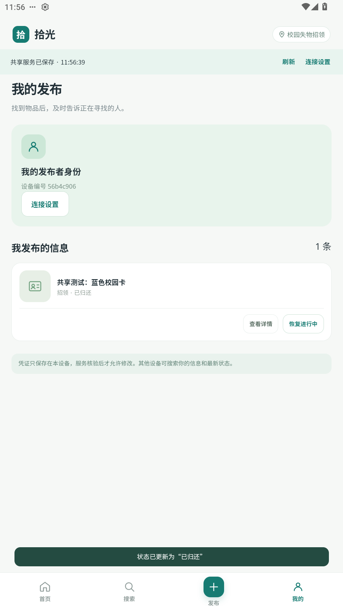
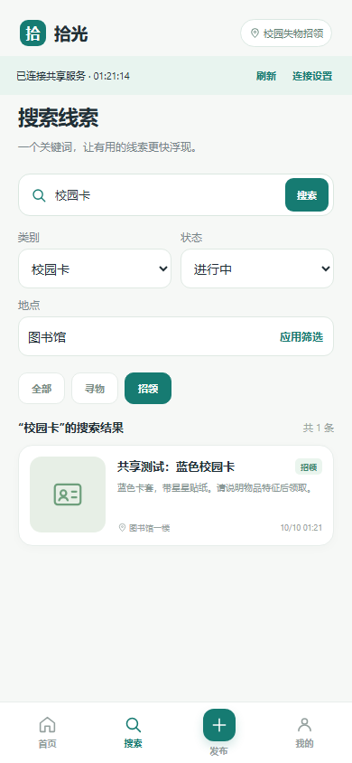
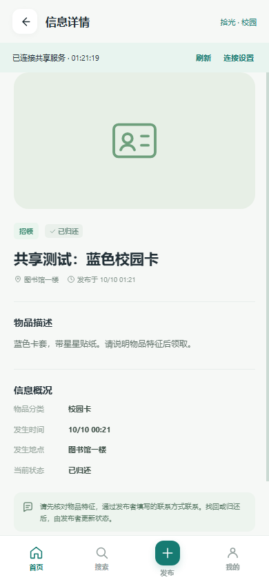
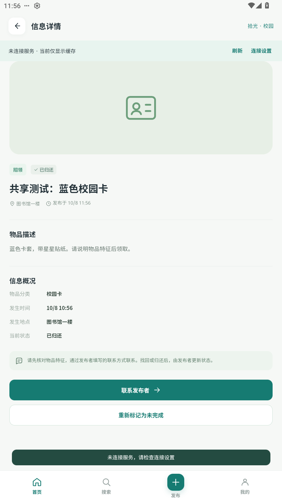
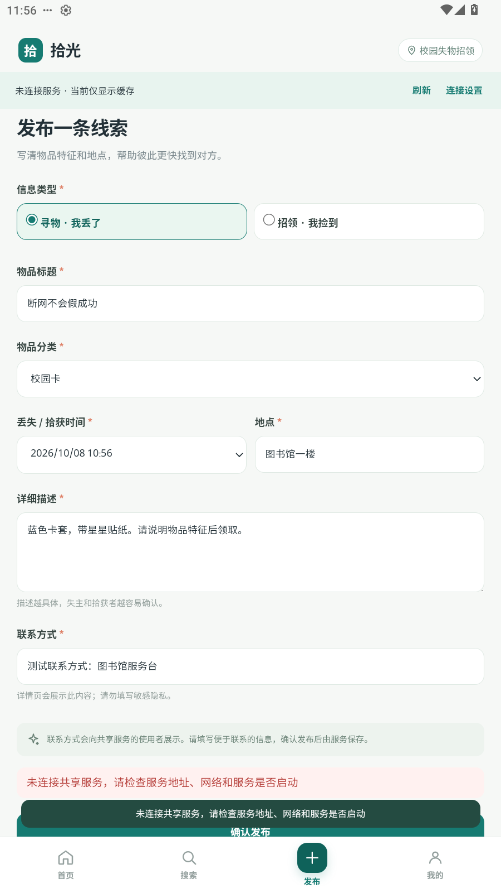
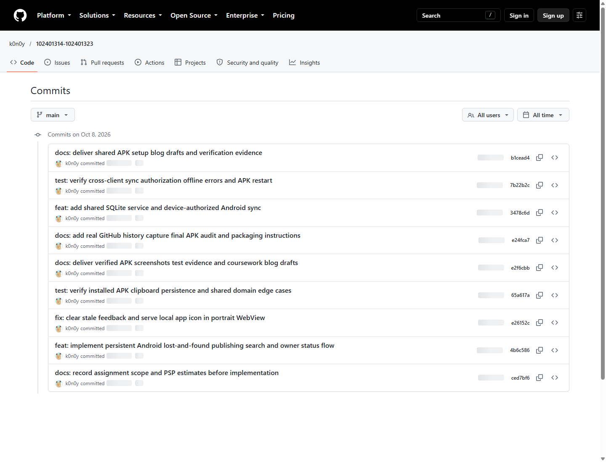

# 2026秋软件工程第二次结对作业：拾光校园失物招领共享App

> 发布前核实：技术实现使用Codex辅助开发和验证；以下截图与测试有实际证据。博客链接、个人分工、PSP实际、协作经历和队友评价须本人填写。APK在Android12模拟器实装，并与独立浏览器验证共享；没有把它写成两人实体手机试玩。

| 项目 | 内容 |
| --- | --- |
| 所属课程 | [软件工程与软件工程实践](https://edu.cnblogs.com/campus/fzu/2026-01SoftwareEngineeringandSoftwareEngineeringPractice/) |
| 作业要求 | [第二次结对作业之程序实现](https://edu.cnblogs.com/campus/fzu/2026-01SoftwareEngineeringandSoftwareEngineeringPractice/homework/16745) |
| 作者 | 陈勇昊（102401323） |
| 结对成员 | 曾炜毅102401314、陈勇昊102401323 |
| 本人博客主页 | 【待填真实链接】 |
| 队友博客主页 | 【待填真实链接】 |
| 本次作业博客 | 【发布后填写本人及队友文章链接】 |
| GitHub | [102401314-102401323](https://github.com/k0n0y/102401314-102401323) |
| APK | [共享版1.1.0](https://github.com/k0n0y/102401314-102401323/raw/refs/heads/main/apk/shiguang-1.1.0.apk) |
| 上次原型 | [拾光原型](https://k0n0y.github.io/campus-lost-found-prototype/) |

## 一、具体分工

【请改为真实分工】建议曾炜毅复核App交互、原生壳及构建；陈勇昊复核接口、白盒测试、使用说明和实际手机体验。建议不能作为已发生贡献；请附本人commit、真实fork/PR及讨论记录。当前没有另一成员贡献的证明。

## 二、PSP记录

原阶段在编码前留下325分钟规划，实际栏未伪造。共享补充阶段在编码前另记录需求复审15、接口身份设计20、实现80、服务及双客户端验证35、构建安装20、材料25，共195分钟。它们是助手开发规划，不是两人个人实际投入。

| PSP2.1 | Personal Software Process Stages | 预估 | 曾炜毅实际 | 陈勇昊实际 |
| --- | --- | ---: | --- | --- |
| Planning | 计划（小计） | 15 | 待记录 | 待记录 |
| Estimate | 估计任务所需时间 | 15 | 待记录 | 待记录 |
| Development | 开发（小计） | 250 | 待记录 | 待记录 |
| Analysis | 需求分析及学习新技术 | 30 | 待记录 | 待记录 |
| Design Spec | 设计文档 | 20 | 待记录 | 待记录 |
| Design Review | 设计复审 | 15 | 待记录 | 待记录 |
| Coding Standard | 制定代码规范 | 10 | 待记录 | 待记录 |
| Design | 具体设计 | 25 | 待记录 | 待记录 |
| Coding | 编码 | 90 | 待记录 | 待记录 |
| Code Review | 代码复审 | 20 | 待记录 | 待记录 |
| Test | 测试与修复 | 40 | 待记录 | 待记录 |
| Reporting | 报告（小计） | 60 | 待记录 | 待记录 |
| Test Report | 测试报告 | 20 | 待记录 | 待记录 |
| Size Measurement | 计算工作量 | 10 | 待记录 | 待记录 |
| Postmortem & Process Improvement Plan | 总结与改进计划 | 30 | 待记录 | 待记录 |
| 合计 | 只累加明细，避免重复计小计 | 325 | 待记录 | 待记录 |

【待填实际耗时及偏差分析：哪些环节超过预估，原因是什么，下次如何安排。】完整补充规划在docs/PSP.md，不能把助手执行耗时写成本人工作时长。

## 三、解题思路与模块设计

校园信息分散、关键词难查、物品归还后旧消息仍被询问。保留上次原型的薄荷绿界面、首页卡片、发布、搜索、详情和我的发布，做成实际Android APK，实现“发布—浏览/搜索—详情—联系—更新状态”。

初版仅本机保存不能体现不同设备的集中信息。本次增加一个轻量共享服务：正式信息保存在SQLite，不同设备连接同一个地址。每台安装实例取得独立随机发布者凭证，服务只保存其摘要，修改时核验记录归属；不是通过界面选择甲/乙来授予权限。无需复杂后台、实名认证、地图或即时聊天。

UI使用HTML/CSS/JavaScript，Android系统WebView加载内置资源；Java后台线程调用HTTP接口，结果回到页面。domain.js复用输入校验和搜索，network.js封装请求，app.js处理路由、同步、表单、缓存与草稿，server.cjs处理共享、凭证和数据库。

手机约5秒同步公共列表，也可手动刷新。断网只读取最近缓存，发布或更新失败保持输入和原状态。服务重启保留数据；手机强停重开保留凭证。本包提供局域网运行说明、公网HTTPS部署参考，但当前未部署公网。

## 四、流程图、数据流图及关键代码


发布时先校验字段，将设备本地时间转换为带时区ISO，再携带凭证提交。服务再次校验、写入数据库，确认后才展示成功。联系后由原发布者确认状态变更，服务更新单条记录，其他设备同步。取消确认不会发送变更请求。

服务的身份校验直接读取凭证摘要匹配的发布者，客户端提供ownerId不能代替认证：

```javascript
  function auth(req) {
    const token = /^Bearer ([a-f0-9]{64})$/.exec(req.headers.authorization || '')?.[1];
    const user = token && db.prepare('SELECT id FROM publishers WHERE token_hash=?').get(hash(token));
    if (!user) fail(401, '发布者凭证无效，请重新连接服务');
    return user.id;
  }
```

状态修改进一步检查该编号是否属于原发布者：

```javascript
if (auth(req) !== row.owner_id) fail(403, '只有发布者能更新状态');
```

重试使用requestKey和内容摘要；相同请求返回原记录，不同内容复用同编号返回409。这避免网络响应丢失后用户重试生成重复信息。并发发布写独立数据库行，不能用旧的本机列表覆盖他人记录。

## 五、额外特点的意义、实现和展示

1. **组合筛选**：在很多相似物品中缩小范围，关键词、类型、类别、地点、处理状态同时满足才命中。统一Unicode和大小写，多词按全部命中处理；服务和页面复用实际搜索函数。
2. **一键复制联系方式**：详情弹窗由发布者字段生成，Android调用系统剪贴板，在应用外自行联系，不增加即时聊天。
3. **草稿、缓存和失败提示**：切换页面恢复表单；断网可读已有缓存，写入失败不假报成功，恢复后可重试。
4. **状态确认及恢复**：降低误标记；确认后原发布者可恢复进行中，其他设备同步新状态。

搜索的关键代码：

```javascript
  function search(items, { q = '', kind = 'all', category = 'all', place = '', status = 'all' } = {}) {
    const words = normalize(q).split(/\s+/).filter(Boolean);
    return items.filter(item => {
      const text = normalize(`${item.title} ${item.category} ${item.place} ${item.description}`);
      return words.every(word => text.includes(word)) &&
        (kind === 'all' || item.kind === kind) &&
        (category === 'all' || item.category === category) &&
        (!normalize(place) || normalize(item.place).includes(normalize(place))) &&
        (status === 'all' || item.status === status);
    }).slice().sort((a, b) => Date.parse(b.postedAt) - Date.parse(a.postedAt) || a.id.localeCompare(b.id));
  }
```

安装版发布与状态截图：









独立客户端乙的实际搜索和同步截图（浏览器模拟移动屏幕，不是第二台实体手机）：









## 六、目录与使用说明

```text
apk/                         签名1.1.0 APK
server/server.cjs            共享服务、SQLite、凭证和接口
web/                         内置页面、样式、业务和网络模块
android/app/src/main/        原生入口、网络线程、缓存存储、图标
tests/                       业务、接口及持久化测试
scripts/                     构建、验收、材料生成
docs/                        博客、PSP、截图、测试和提交清单
evidence/                    实际测试和签名校验输出
启动共享服务.cmd              Windows启动入口
```

助教先在电脑安装Node24，下载整个仓库，双击启动服务，记下输出的局域网地址；手机安装apk/shiguang-1.1.0.apk，在连接设置填写该地址，两设备与电脑处于同一局域网。初始为空，甲发布、乙搜索详情及联系、甲标记完成、乙同步。无需安装npm第三方依赖；直接安装APK不需要JDK/AndroidSDK。

服务窗口需保持运行。手机不能填localhost，它指向手机自身；实际IP来自服务输出，不要照抄截图中的测试端口。手机开不了服务地址/api/health时检查IP、局域网及防火墙；校园网络隔离可改用同一热点。公网需自行部署HTTPS，仓库提供参考而没有假称已上线。

设备保存自己的凭证，清除应用数据会失去修改权限；服务正式记录仍保留。停止服务后备份data目录。同服务更换地址通过serverId识别，避免IP改变后丢身份。旧离线记录保留但不自动上传，真实内容核实后重新发布。

## 七、单元测试教程与实际结果

采用[Node内置测试框架](https://nodejs.org/api/test.html)。安装Node24，运行npm test；用npm run test:coverage观察分支执行。先写正常断言，再按源代码条件检查无凭证、他人凭证、无效字段、重复请求、并发和重启等失败路径。边界测试覆盖max/max+1、空值/空格、非法/未来时间。

网络权限测试直接调用实际服务，不只测试页面隐藏按钮。例：

```javascript
const a=await session(), b=await session();
const {body}=await publish(a);
const result=await call('/api/items/'+body.item.id+'/status',
  'PATCH',{status:'resolved',ownerId:a.ownerId},b.token);
assert.equal(result.status,403);
```

测试工厂在server.test.cjs定义。普通用例使用独立内存数据库，重启用例使用临时SQLite文件，不影响正式数据库。原31个业务测试包含旧数据兼容回归，不把旧身份切换当作当前授权；新增24个API及集成测试针对共享服务。

**实测55/55个测试通过，24项独立浏览器界面检查、21项APK与独立客户端检查通过。** domain.js行覆盖98.86%、分支92.39%、函数100%；网络服务的覆盖率另在日志中，不能以domain覆盖率代替整个App。

检查包括甲发布乙读取、越权403、甲更新乙自动同步、服务中断、缓存、写入失败、恢复重试、数据库重启、身份和记录重开保留。日志在evidence/unit-tests.txt及带network的JSON。APK检查还覆盖原生剪贴板和返回键。尚无两位本人实体手机试玩记录；这些结果不等同于助教评分。

## 八、GitHub签入记录与协作

[当前提交记录](https://github.com/k0n0y/102401314-102401323/commits/main/)。材料生成时的真实Git记录如下，后续提交以仓库为准：

```text
b1cead4 docs: deliver shared APK setup blog drafts and verification evidence
7b22b2c test: verify cross-client sync authorization offline errors and APK restart
3478c6d feat: add shared SQLite service and device-authorized Android sync
e24fca7 docs: add real GitHub history capture final APK audit and packaging instructions
e2f6cbb docs: deliver verified APK screenshots test evidence and coursework blog drafts
65a617a test: verify installed APK clipboard persistence and shared domain edge cases
e26152c fix: clear stale feedback and serve local app icon in portrait WebView
4b6c586 feat: implement persistent Android lost-and-found publishing search and owner status flow
ced7bf6 docs: record assignment scope and PSP estimates before implementation
```



【待填另一成员真实fork与PR链接】。另一人用自己的账号fork，做真实改进后提交PR。不能用同一账号空提交冒充结对。两人需分别发布博客并完成班级表登记。

## 九、实际问题、尝试与解决

1. **离线方案范围不足**：本机数据不能被另一台设备读取。复审作业的集中浏览和发布者状态闭环后增加共享服务、独立凭证、数据库，保留客户端缓存。用APK与独立浏览器实际验证读取和修改权限。
2. **设备与服务时区不同**：初次APK联网发布被服务误判未来时间。客户端提交带时区ISO，API拒绝无时区输入，增加回归测试后安装验证通过。
3. **并发与重试**：整份列表保存会覆盖别人的发布，网络重试可能重复。本版按记录独立写入，ownerId/requestKey唯一约束与内容摘要控制重试，接口测试验证并发和重试。
4. **中文目录打包兼容**：Android Windows工具曾无法识别Unicode绝对路径，改用相对参数后正常打包。中文HTTP内容也补充UTF8跨网络分段测试。

上述是助手辅助实施中的真实问题。【待本人补充实际结对讨论、尝试和解决经历】，不能将调试过程写成两人已经发生的协作。

## 十、队友评价与个人总结

【待本人填写真实评价：值得学习的地方与具体事例、需要改进的地方与可执行建议。】

【个人总结待本人核实】请结合自己真正参与的设计、代码、测试或复审记录填写，写明实际收获和不足。

本次技术实现表明，页面可点击还需要检查共享存储、发布者权限、错误输入、断网与持久化。后续主要验证实体手机和实际网络环境；博客发表、真实PR和班级提交状态以实际链接与成功证据为准。
