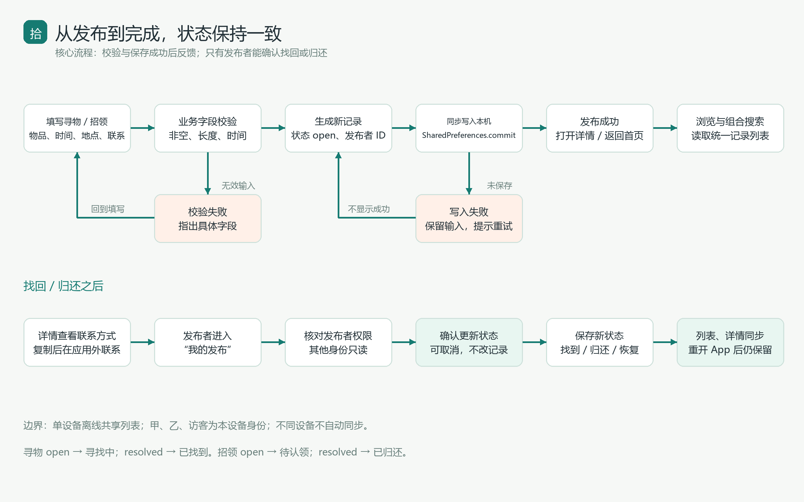
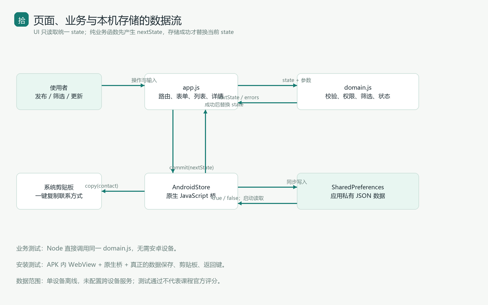
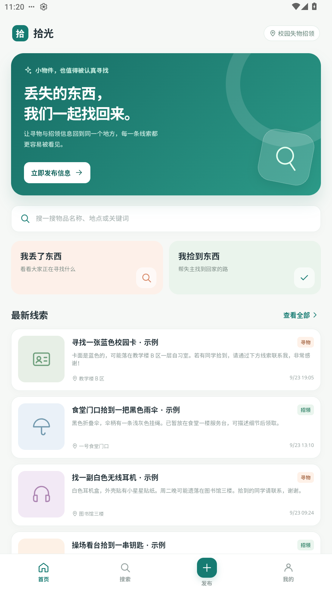
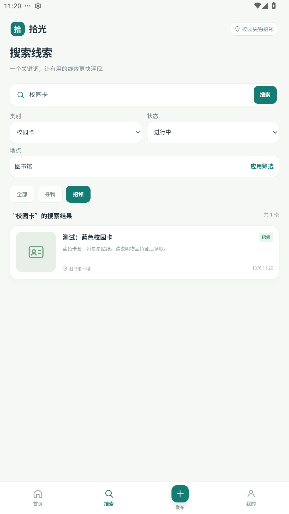
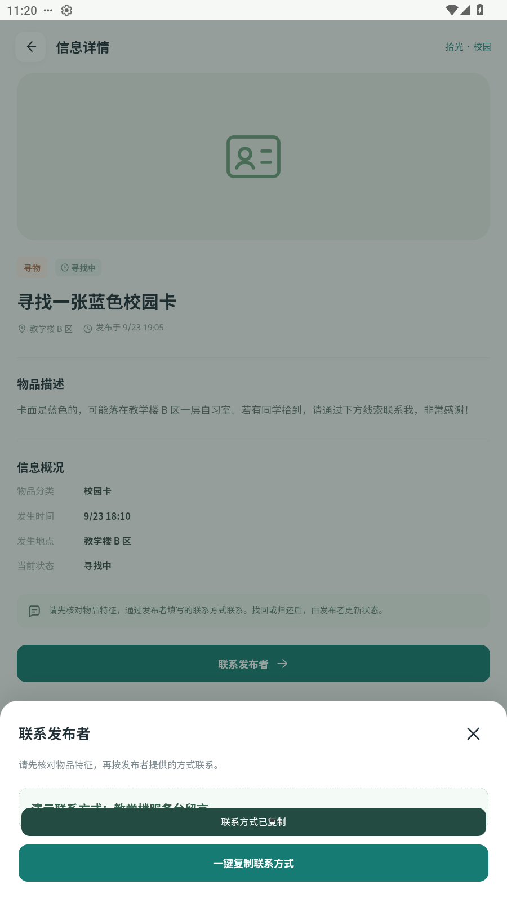
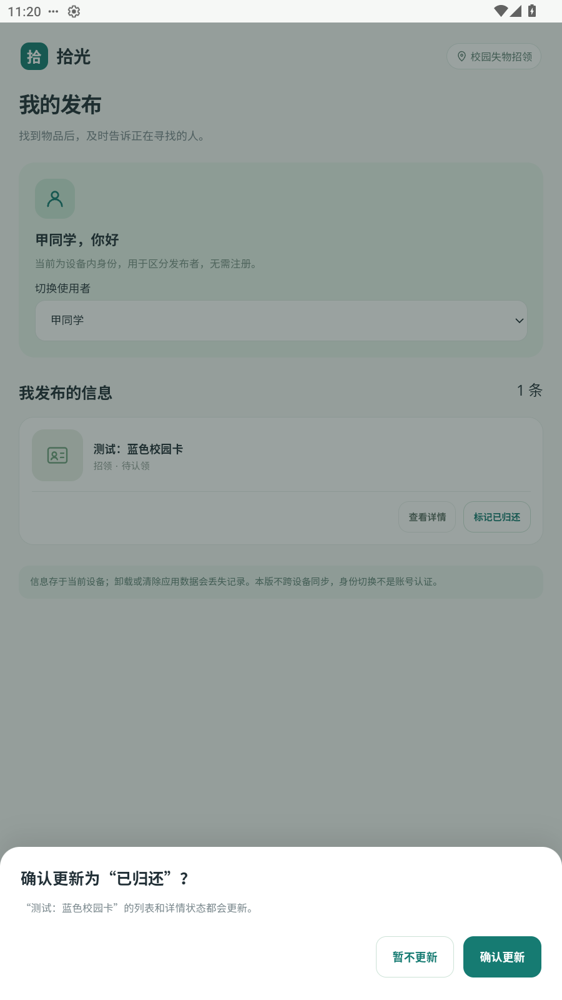
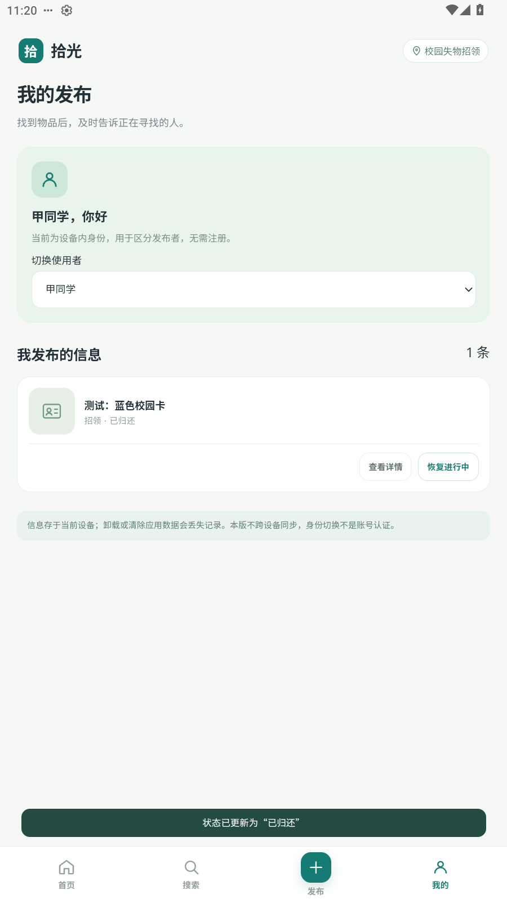
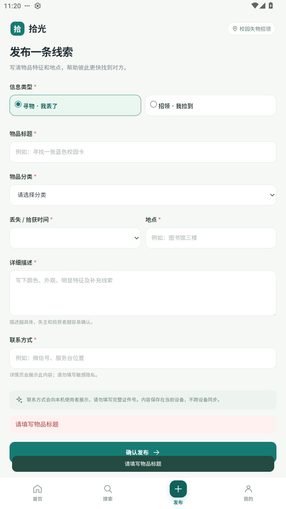

# 2026 秋软件工程第二次结对作业：拾光校园失物招领 App

> 发布前核实：本稿的程序、测试和截图有本地证据；博客链接、PSP 实际、个人分工、协作经历和队友评价仍需本人填写。程序采用 Codex 辅助开发与验证，不将助手工作或模拟器检查写成本人实测。本版为单设备离线 App，不同手机不共享记录。

| 项目 | 内容 |
| --- | --- |
| 所属课程 | [H202601 软件工程与软件工程实践](https://edu.cnblogs.com/campus/fzu/2026-01SoftwareEngineeringandSoftwareEngineeringPractice/) |
| 作业要求 | [2026 秋软件工程第二次结对作业之程序实现](https://edu.cnblogs.com/campus/fzu/2026-01SoftwareEngineeringandSoftwareEngineeringPractice/homework/16745) |
| 本文作者 | 陈勇昊（102401323） |
| 结对成员 | 曾炜毅（102401314）、陈勇昊（102401323） |
| 本人博客主页 | 【待填真实博客主页链接】 |
| 队友博客主页 | 【待填真实队友博客链接】 |
| 本次博客链接 | 【发布后填写本人文章链接；另补队友本次文章链接】 |
| GitHub 仓库 | [102401314-102401323](https://github.com/k0n0y/102401314-102401323)（发布状态以实际仓库证据为准） |
| APK | [下载拾光 App](https://github.com/k0n0y/102401314-102401323/raw/refs/heads/main/apk/shiguang-1.0.0.apk) |
| 上次原型 | [拾光 Pencil 原型](https://k0n0y.github.io/campus-lost-found-prototype/) |

## 一、具体分工

技术实施已完成。以下为建议分工，**不能直接作为双方真实贡献提交**：曾炜毅承担页面流程、Android 壳与打包复核；陈勇昊承担测试案例、手机试玩及说明复核。请两人按真实参与修改，并附上各自 commit、fork/PR 或讨论证据。当前本地进展提交不能证明另一位成员已经完成 fork 或 PR。

## 二、PSP 记录与偏差分析

在正式编码前记录预估，按需求、设计、编码、复审、测试、报告分解任务。预估单位为分钟，是开发规划参考；实际两栏须由各人按真实记录填写。父级小计不重复计入合计。

| PSP2.1 | Personal Software Process Stages | 预估 | 曾炜毅实际 | 陈勇昊实际 |
| --- | --- | ---: | --- | --- |
| Planning | 计划（小计） | 15 | 待记录 | 待记录 |
| Estimate | 估计任务所需时间 | 15 | 待记录 | 待记录 |
| Development | 开发（小计） | 250 | 待记录 | 待记录 |
| Analysis | 需求分析及学习新技术 | 30 | 待记录 | 待记录 |
| Design Spec | 设计文档 | 20 | 待记录 | 待记录 |
| Design Review | 设计复审 | 15 | 待记录 | 待记录 |
| Coding Standard | 制定代码规范 | 10 | 待记录 | 待记录 |
| Design | 具体设计 | 25 | 待记录 | 待记录 |
| Coding | 编码 | 90 | 待记录 | 待记录 |
| Code Review | 代码复审 | 20 | 待记录 | 待记录 |
| Test | 测试与修复 | 40 | 待记录 | 待记录 |
| Reporting | 报告（小计） | 60 | 待记录 | 待记录 |
| Test Report | 测试报告 | 20 | 待记录 | 待记录 |
| Size Measurement | 计算工作量 | 10 | 待记录 | 待记录 |
| Postmortem & Process Improvement Plan | 总结与改进计划 | 30 | 待记录 | 待记录 |
| 合计 | 只累加明细，避免重复计小计 | 325 | 待记录 | 待记录 |

【待填实际偏差分析：哪个步骤超时、原预估忽略了什么、两人分别投入多少时间。】本次已发现打包路径兼容、原生资源加载和安装后持久化需要单独安排检查，因此后续计划应预留这些环节；不能只按页面数量估时。

## 三、解题思路与模块设计

校园失物招领的主要痛点是信息散落在群聊中、搜索困难、处理完毕后旧消息仍被反复询问。延续上次原型的首页、发布、搜索、详情和“我的发布”，本次将界面升级为实际 Android APK，实现“发布—浏览或搜索—详情—联系—更新状态”的闭环。

界面层用 HTML/CSS/JavaScript，保留原型的薄荷绿配色、寻物与招领标签、卡片和底部导航；Android 用系统 WebView 加载内置资源。该方式参考 [Android 官方自有网页嵌入说明](https://developer.android.com/develop/ui/views/layout/webapps)。无需浏览器跳转或远程网站，安装后离线运行。

`domain.js` 只负责输入校验、生成记录、组合搜索、发布者权限和状态；`app.js` 负责路由、表单、卡片、弹窗和草稿；`MainActivity.java` 负责 WebView、本机保存、系统剪贴板与返回键。把业务模块与页面分开后，Node 单元测试可以直接运行 App 的同一份函数。

正式状态保存在应用私有 SharedPreferences 中。先形成新状态，磁盘保存成功后才替换界面状态。初次提供虚构样例，真实新记录有发布者 ID；寻物状态为寻找中/已找到，招领为待认领/已归还。用设备内甲、乙、访客区分操作权限，不提供实名认证或账号认证。当前不跨设备同步，不承诺已经向全校上线。

## 四、关键流程图、数据流图与代码

发布时校验类别、信息类型、必填文本、长度和发生时间；无效输入留在表单，保存失败不跳到成功页。联系后由发布者进入“我的发布”或本人详情，确认标记已找到或已归还。取消确认不更改记录，更新后所有列表和详情读同一状态。





关键代码一：业务发布生成新列表，不修改旧状态；重复编号被拒绝。

```javascript
  function publish(state, input, options) {
    const item = createItem(input, state.currentUser, options);
    if (state.items.some(entry => entry.id === item.id)) throw new Error('信息编号重复，请重新发布');
    return { ...state, items: [item, ...state.items] };
  }
```

关键代码二：权限在业务层再次检查，避免仅凭“隐藏按钮”限制修改。

```javascript
  function setStatus(state, id, status) {
    if (!['open', 'resolved'].includes(status)) throw new Error('处理状态无效');
    const item = state.items.find(entry => entry.id === id);
    if (!item) throw new Error('这条信息不存在');
    if (state.currentUser === 'guest' || item.ownerId !== state.currentUser) throw new Error('只有发布者能更新状态');
    return { ...state, items: state.items.map(entry => entry.id === id ? { ...entry, status } : entry) };
  }
```

关键代码三：本机写入失败会抛出错误。界面调用此函数成功后才更新 `state` 和显示成功，因此异常不会被掩盖。

```javascript
  function commit(next, storage) {
    const result = storage.setItem('shiguang-app-state-v1', JSON.stringify(next));
    if (result === false) throw new Error('保存失败：请检查设备存储空间后重试');
    return next;
  }
```

## 五、附加特点设计与成果展示

**特点一：关键词、类型、类别、地点与处理状态组合筛选。** 不同种类的物品和已经归还的信息混在一起会影响寻找效率；多个条件按“同时满足”组合，关键词匹配名称、类别、地点和描述。输入多个词时每个词都必须命中，并折叠大小写与全角字符。以下为实际代码：

```javascript
  function search(items, { q = '', kind = 'all', category = 'all', place = '', status = 'all' } = {}) {
    const words = normalize(q).split(/\s+/).filter(Boolean);
    return items.filter(item => {
      const text = normalize(`${item.title} ${item.category} ${item.place} ${item.description}`);
      return words.every(word => text.includes(word)) &&
        (kind === 'all' || item.kind === kind) &&
        (category === 'all' || item.category === category) &&
        (!normalize(place) || normalize(item.place).includes(normalize(place))) &&
        (status === 'all' || item.status === status);
    }).slice().sort((a, b) => Date.parse(b.postedAt) - Date.parse(a.postedAt) || a.id.localeCompare(b.id));
  }
```

**特点二：一键复制联系方式。** 联系弹窗保留发布者填写的文本，并调用 Android 系统剪贴板。使用者核对特征后自行在应用外联系，不虚构站内聊天已经发生。实现入口为 `AndroidStore.copy(item.contact)`，原生方法调用 `ClipboardManager.setPrimaryClip`，只有成功时显示“联系方式已复制”。

**特点三：草稿恢复与状态确认。** 填到一半离开发布页后恢复本设备草稿；更新状态先提示具体物品与新状态，可取消，也可重新恢复进行中。减少误操作，且不增加后台或认证范围。

以下均为实际安装 APK 的 Android 12 模拟器截图，使用虚构测试数据；不是人工手机试玩记录。













## 六、目录组织与运行说明

```text
apk/                           可直接安装的签名 APK
android/app/src/main/          Android 入口、Java 存储桥和图标
web/index.html                 页面外壳及 SVG 图标
web/styles.css                 移动界面样式
web/app.js                     页面交互、路由和反馈
web/domain.js                  可测试的业务函数
tests/domain.test.cjs          31 个单元测试
scripts/                       构建、测试、图示与材料生成
docs/                          博客稿、PSP、截图与说明
evidence/                      实测输出、JSON 检查记录与哈希
```

助教下载项目后直接把 `apk/shiguang-1.0.0.apk` 传到 Android 8.0 以上手机，允许该来源安装，打开“拾光·校园失物招领”。不需要 Node、服务器或账号即可使用 App；重新编译才需要 JDK 和 Android SDK。Android WebView 建议更新。安装验证使用 Android 12，不将 manifest 的最低版本声明写成所有机型均实测通过。

操作：先浏览并点进详情，再发布一条招领，搜索关键词并使用筛选；联系之后到“我的发布”更新状态。切换乙同学可看到公共列表的新状态，但不能更新甲的记录；切回甲，关闭后重开，状态保留。更详细的操作与构建路径已写入 README。卸载或清除 App 数据会删除记录。

## 七、单元测试学习、案例设计与结果

选用 Node 内置的 [node:test](https://nodejs.org/api/test.html) 和 `assert/strict`。先确定函数输入与预期，再写断言，随后检查函数的判断分支，补充异常和边界；运行 `npm test`，不需要额外安装 npm 包。用 `npm run test:coverage` 检查业务函数覆盖情况。

初学者可从“其他人不能更新甲的发布”开始：构造甲发布的记录，把当前身份改为乙，调用状态更新并断言抛出权限错误。实际 U19 代码如下（`state()` 和 `item()` 是文件中定义的固定测试数据工厂）：

```javascript
test('U19 其他使用者和访客不能更新他人状态', () => {
  for (const user of ['student-b', 'guest']) {
    assert.throws(() => D.setStatus({ ...state(), currentUser: user, items: [item()] },
      'one', 'resolved'), /只有发布者/);
  }
});
```

采用白盒分支设计，同时使用等价类和边界值。必填项分别验证空值与纯空格，长度验证上限和上限加一，时间验证非法、未来与恰好等于当前。搜索验证多字段命中、多词、空结果与条件冲突；权限验证本人、他人、访客；存储验证正常写入、返回 false、抛异常与损坏恢复。固定时间和 ID，使测试可以重复。

本地实测：**31/31 个单元测试通过**；`domain.js` 行覆盖 98.86%，分支覆盖 92.39%，函数覆盖 100%。另外 **25 项浏览器检查、22 项 Android 12 安装版检查通过**，覆盖原生复制与强制停止后重开保存。日志在 evidence 中可核查。

这些用例能覆盖主要业务和失败分支，但不能证明所有机型或真实使用场景都没有问题。UI 检查和单元测试不是助教官方评分；手机人工试玩记录仍待本人补充。

## 八、代码签入与 GitHub 协作

当前本地真实提交记录如下，保留实施进展，不伪造另一名成员的签入：

```text
65a617a test: verify installed APK clipboard persistence and shared domain edge cases
e26152c fix: clear stale feedback and serve local app icon in portrait WebView
4b6c586 feat: implement persistent Android lost-and-found publishing search and owner status flow
ced7bf6 docs: record assignment scope and PSP estimates before implementation
```

[GitHub 提交记录页面](https://github.com/k0n0y/102401314-102401323/commits/main/)。

【此处插入实际 GitHub 提交记录页面截图；本地 log 不代替要求的截图。】

【待填另一成员真实 fork 地址与 Pull Request 链接。】另一成员应在自己的 GitHub 账号完成真实贡献并 PR，例如手机试玩发现问题后补测试或修复；不能用同一账号创建空提交冒充两人协作。群内结对表和项目地址仍需两人核对并填写。

## 九、实际遇到的问题、尝试与解决

1. **Windows 中文目录影响 Android 工具读取资源。** 首次打包资源时工具报告目录不存在，实际文件存在。将资源、输出与 SDK 参数改为相对路径，保留 Unicode 工作目录，由官方工具完成打包；之后通过 APK v2/v3 签名验证与模拟器安装。这提醒我们使用说明需要包括中文路径环境，而不只是默认英文路径。
2. **发布错误的提示在切换页面后短暂残留。** 检查截图时发现搜索页还显示上一页的未来时间提示。将路由渲染时清除旧提示，状态操作仍在更新完成后显示新的反馈；重新截图与交互验证通过。
3. **内置 WebView 图标请求出现 404。** 本地资源白名单起初未包含网页图标。添加内置 SVG 图标和对应 MIME 类型，重新构建安装；最后一轮安装检查无资源或脚本错误。
4. **交互脚本对固定初始数据作了假设。** 重跑时首页第一条已经变成测试发布，检查器仍期待固定示例联系方式。改为对照被点击记录的实际联系方式，并在干净测试实例完成最终验证。问题来自测试假设，不能为了测试通过把业务数据写死。

【待本人补写真实结对沟通困难、各自尝试与解决过程。】目前没有提供本次结对协作证据，不将上述助手调试过程描述为两人已经共同完成的讨论。

## 十、队友评价与个人总结

【待填写真实队友评价：值得学习的地方 + 一个具体事例；需要改进的地方 + 可执行建议。】不要仅根据建议分工写出未经发生的合作经历。

【个人总结草稿，须本人结合参与核实】我准备重点从测试与使用者角度检查：不同类型状态文案是否一致、他人能否误改、无结果和错误输入是否容易理解。后续应完成自己的手机试玩、复审记录与真实 PR，再总结实际收获。

本次技术实现表明，页面可点击并不等于流程已完成：还要检验保存失败、状态修改权限、取消确认和重开后的数据。后续若需要全校多人使用，需新增共享服务与身份机制；当前交付明确限于单设备离线版。
